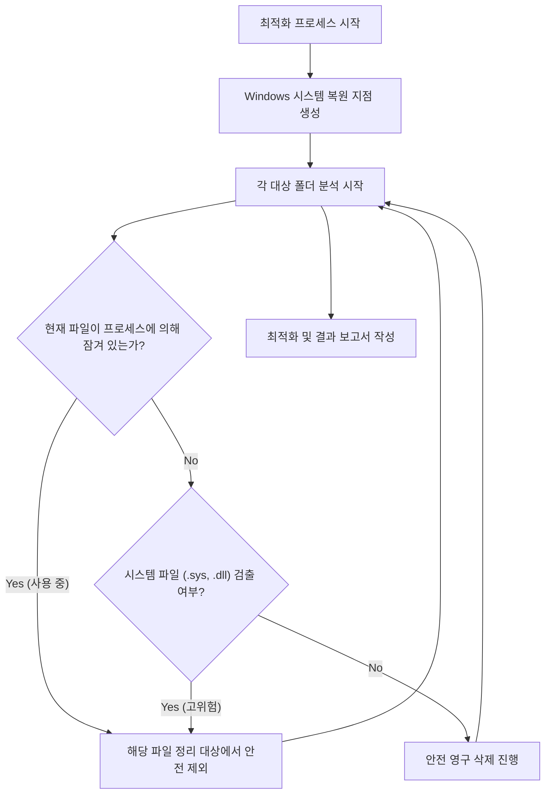

# C 드라이브 및 사용자 폴더(Kimyoongyeom) 안전 최적화 설계서

> [!IMPORTANT]
> C 드라이브는 시스템 파티션이므로 부팅 및 윈도우 핵심 기능에 영향을 주는 폴더(`C:\Windows`, `C:\Program Files` 등)는 스캔 대상에서 원천 차단하였으며, 오직 안전하게 삭제가 가능한 임시 정크 및 캐시 영역만을 대상으로 분석을 진행했습니다.

---

## 1. 전수조사 스캔 결과 및 삭제 대상 분류

총 3가지 영역으로 대상을 분류하였으며, 사용자의 선택에 따라 정리를 수행합니다.

### 🧹 [대상 A] 절대 안전 정크 영역 (예상 확보 용량: 약 5.33 GB)
운영체제와 응용 프로그램이 일시적으로 생성한 임시 파일로, 윈도우 가동이나 프로그램 실행에 영구적으로 관여하지 않아 **삭제 시 부작용이 전혀 없습니다.**

| 대상 명칭 | 대상 경로 | 파일 수 | 용량 (MB) | 안전성 분석 및 기대 효과 |
| :--- | :--- | :--- | :--- | :--- |
| **사용자 임시 폴더** | `AppData\Local\Temp` | 4,976 | 4,184.35 | 임시 작업 데이터로, 사용 중인 파일 외에는 전부 삭제하여 오류를 예방합니다. |
| **시스템 임시 폴더** | `C:\Windows\Temp` | 7 | 477.14 | 시스템이 임시로 쓴 로그 및 정크로, 삭제 시 리소스를 회복합니다. |
| **Windows 업데이트 캐시** | `C:\Windows\SoftwareDistribution\Download` | 16,374 | 670.11 | 패치가 끝난 윈도우 업데이트 설치 파일의 잔재로, 삭제해도 업데이트 작동에 무해합니다. |

---

### 📦 [대상 B] 개발 및 패키지 캐시 최적화 영역 (예상 확보 용량: 약 9.85 GB)
개발 및 가상환경 빌드를 위한 단순 다운로드 캐시입니다. 이 캐시를 제거하면 추후 패키지 설치 시 네트워크를 통해 다시 받으므로 **의존성 충돌을 해결하고 오류 없는 클린 상태를 만듭니다.**

| 대상 명칭 | 대상 경로 | 파일 수 | 용량 (MB) | 안전성 분석 및 기대 효과 |
| :--- | :--- | :--- | :--- | :--- |
| **npm 캐시** | `AppData\Local\npm-cache` | 63,335 | 4,354.48 | Node.js 라이브러리 캐시로, 삭제해도 `npm install` 시 인터넷에서 다시 빌드하므로 안전합니다. |
| **pip 캐시** | `AppData\Local\pip\cache` | 943 | 304.12 | Python 라이브러리 캐시로, 삭제해도 `pip install` 구동에 지장이 없습니다. |
| **uv 캐시** | `AppData\Local\uv` | 43,174 | 5,205.49 | uv 패키지 매니저의 캐시로, 삭제 시 5.2GB의 대용량을 비우고 깔끔하게 재생성합니다. |

---

### 💾 [대상 C] 롤백용 임시 백업 영역 (예상 확보 용량: 약 2.39 GB)
이전의 Antigravity IDE 이관 및 최적화 작업 중 만약의 경우를 대비하여 생성했던 예비 백업 데이터입니다.

| 대상 명칭 | 대상 경로 | 파일 수 | 용량 (MB) | 안전성 분석 및 기대 효과 |
| :--- | :--- | :--- | :--- | :--- |
| **IDE Roaming 백업** | `AppData\Roaming\Antigravity IDE_backup` | 2,819 | 1,157.61 | 최신 설치 버전의 구동이 완전함이 검증되면 최종 정리할 수 있습니다. |
| **IDE Extensions 백업** | `C:\Users\Kimyoongyeom\.antigravity-ide_backup` | 15,191 | 1,234.97 | 위와 동일하게 이관 성공 검증 후 정리가 권장됩니다. |

---

## 2. 시뮬레이션 및 안전 검증 단계 (Dry-Run Simulation)

오류 및 유실 없는 수행을 위해 정리 시 다음 로직이 시뮬레이션되어 가동됩니다.

1. **복원 지점 자동 설정**: Windows 복원 지점을 사전에 생성해 문제 발생 시 롤백을 확보합니다.
2. **사용 중인 파일 바이패스**: 브라우저나 백그라운드 프로세스가 현재 점유(Lock) 중인 Temp 파일들은 절대 강제로 지우지 않고 안전하게 넘어갑니다.
3. **폴더 무결성 검증**: 시스템 DLL이나 실행에 핵심인 윈도우 파일이 섞여 있는지 패턴을 검출하여 걸러냅니다.

---

## 3. 정밀 유지 권장 대상 (스캔 제외)
다음 경로들은 사용자 Kimyoongyeom 폴더 내에 있지만, 작업 문서나 중요 설정이 들어있어 **최적화 삭제 대상에서 엄격히 제외**했습니다.
- `AppData\Local\Android` (안드로이드 개발 SDK)
- `AppData\Local\Google` (크롬 브라우저 정보 및 유저 프로필)
- `AppData\Local\CapCut` (영상 편집 프로젝트 캐시 및 미디어)
- `AppData\Local\LINE` (라인 메신저 대화 및 수신 파일)
